# Renovate

Renovate is an automated dependency update tool. It helps to update dependencies in your code without needing to do it manually. When Renovate runs on your repo, it looks for references to dependencies (both public and private) and, if there are newer versions available, Renovate can create pull requests to update your versions automatically.  

## Table of Contents

- [Features](#features)
- [Languages and package managers](#languages-and-package-managers)
- [Supported Platforms](#supported-platforms)
- [Ways to run Renovate](#ways-to-run-renovate)
  - [Mend Renovate Community (Cloud-Hosted)](#-mend-renovate-community-cloud-hosted)
  - [Mend Renovate Community (Self-Hosted)](#-mend-renovate-community-self-hosted)
- [Renovate Pull Requests](#renovate-pull-requests)
  - [How Renovate Creates PRs](#how-renovate-creates-prs)
- [What Happens After You Accept the Config PR](#what-happens-after-you-accept-the-config-pr)
  - [1. Renovate Bot Initialization](#1-renovate-bot-initialization)
  - [2. Scanning Dependencies](#2-scanning-dependencies)
  - [3. Update Triggers](#3-update-triggers)
- [What About Breaking Changes?](#%EF%B8%8F-what-about-breaking-changes)
  - [Example Scenario](#example-scenario)
- [Job scheduling and Renovate Status](#job-scheduling-and-renovate-status)
- [Renovate and Changelogs](#renovate-and-changelogs)
  - [What is a changelog?](#what-is-a-changelog)
  - [Where does Renovate look for changelogs?](#where-does-renovate-look-for-changelogs)
- [Concept of private packages](#concept-of-private-packages)
  - [The short truth (before details)](#the-short-truth-before-details)
  - [How Renovate normally succeeds (baseline)](#how-renovate-normally-succeeds-baseline)
  - [Failure mode #1 (MOST COMMON): missing source repository metadata](#failure-mode-1-most-common-missing-source-repository-metadata)
  - [Failure mode #2: Renovate cannot access the source repo (auth problem)](#failure-mode-2-renovate-cannot-access-the-source-repo-auth-problem)
- [Renovate Presets](#renovate-presets)
  - [What Are Presets?](#what-are-presets)
  - [Basic Concept](#basic-concept)
- [References](#-references)


## Features

- Delivers update PRs directly to your repo
   - Relevant package files are discovered automatically
   - Pull Requests automatically generated in your repo
- Provides useful information to help you decide which updates to accept (age, adoption, pass rates, merge confidence)
- Highly configurable and flexible to fit in with your needs and repository standards
- Largest collection of languages and platforms
- Connects with private repositories and package registries

## Languages and package managers
Renovate can provide updates for most popular languages, platforms, and registries including: npm, pnpm, yarn, Java, Python, .NET, Scala, Ruby, Go, Docker and more.

## Supported Platforms
Works with GitHub, GitLab, Bitbucket, Azure DevOps, and more.

## Ways to run Renovate

### 🌐 Mend Renovate Community (Cloud-Hosted)
**What it is:** A free hosted service provided by Mend (the company behind Renovate).

**How it works:** You connect your GitHub/GitLab/Bitbucket repos, and Mend runs Renovate for you in the cloud.

**Pros:**

- Zero infrastructure setup.
- Automatic updates without needing to maintain servers.
- Ideal for individuals, small teams, or open-source projects.

**Cons:**

- Limited customization compared to self-hosted.
- Runs on Mend’s schedule (less control over execution timing).
- May have restrictions on advanced features.

### 🖥 Mend Renovate Community (Self-Hosted)
**What it is:** The open-source Renovate tool you install and run yourself (via Docker, CLI, or CI/CD).

**How it works:** You manage the infrastructure, configuration, and execution.

**Pros:**

- Full control over configuration, scheduling, and scaling.
- Can integrate deeply with enterprise workflows.
- Supports advanced features like custom presets and private registries.

**Cons:**

- Requires setup and maintenance (servers, pipelines).
- More complex for beginners.
- You’re responsible for updates and troubleshooting.

## Renovate Pull Requests

### How Renovate Creates PRs

```mermaid
graph TD
    Start[Renovate Starts] --> Scan[Scans your files]
    Scan --> Check{New Update Found?}
    
    Check -- No --> Sleep[Do nothing]
    Check -- Yes --> PR[Create Pull Request]
    
    PR --> Test[Run Automated Tests]
    
    Test -- Pass --> Merge[Ready to Merge! 🚀]
    Test -- Fail --> Fix[Needs Human Review 🛠️]
```



**Step 1: Discovery**
Renovate scans files in your repo to find dependencies:

  - package.json (Node.js)
  - pom.xml (Java/Maven)
  - requirements.txt (Python)
  - Dockerfile

**Step 2: Check for Updates**
For each dependency, Renovate checks:

  - Current version in your repo
  - Latest available version
  - If there's a newer version → create a PR!

**Step 3: Create the PR**
Renovate automatically:

  - Creates a new branch (e.g., renovate/react-18.x)
  - Updates the dependency version in your files
  - Updates lock files (package-lock.json, yarn.lock)
  - Writes a descriptive PR with release notes
  - Triggers your CI/CD pipeline

**Step 4: PR Content**
Each PR includes:

  - **Title**: Clear description (e.g., "Update dependency react to v18.2.0")
  - **Body**: Release notes, changelog links, compatibility info
  - **Changes**: Updated package.json and lock files
  - **CI status**: Your tests run automatically

**[Pull Request](https://docs.renovatebot.com/key-concepts/pull-requests/)** - Learn more about Renovate pull requests.

## What Happens After You Accept the Config PR

### 1. Renovate Bot Initialization

  - When you add a repo, Renovate first proposes a PR with a starter config (renovate.json containing config:recommended).

  - Once merged, Renovate now knows how to behave in your repo.

### 2. Scanning Dependencies

  - Renovate scans all supported manifest files (package.json, requirements.txt, pom.xml, Dockerfile, etc.) and lock files (yarn.lock, package-lock.json, etc.).

  - It compares the versions in your repo against the latest versions available in the upstream registries (npm, PyPI, Maven Central, Docker Hub, etc.).

### 3. Update Triggers

  - Renovate checks for updates based on:

    - Registry changes: If a new version is published upstream, Renovate detects it.
    - Scheduled runs: Renovate runs on a schedule (default: daily), but you can configure it (e.g., weekends only).
    - Repo changes: If you modify your dependency files, Renovate re-scans them.

  👉 It does not instantly update the repo the moment a new version is published. Instead, it runs on its configured schedule or when triggered by repo changes.

## ⚠️ What About Breaking Changes?
Renovate’s job is to propose updates, not guarantee compatibility. It:

  - Automatically detects outdated dependencies in your project
  - Creates pull requests (PRs) with updated version numbers
  - Updates package lock files (package-lock.json, yarn.lock, etc.)
  - Runs your existing CI/CD tests on the PR

What Renovate Does NOT Do:

  - Does not modify your application code
  - Does not fix breaking changes in your codebase
  - Does not refactor code to match new APIs
  - Does not guarantee the update won't break your app

### Example Scenario:
Let's say you're using React Router v5:
```js
// Your code
import { useHistory } from 'react-router-dom';

function MyComponent() {
  const history = useHistory();
  history.push('/home');
}
```

Renovate will Update package.json and package-lock.json to React Router v6 and trigger your CI tests.
Renovate will NOT change useHistory to useNavigate in your code.
Renovate creates a PR to update to React Router v6. But in v6, useHistory was removed and replaced with useNavigate.
Your CI tests will fail, showing you there's a problem. You then need to manually fix the code.

## Job scheduling and Renovate Status

Tt's actually pretty useful for controlling when Renovate creates or updates PRs because without a schedule, Renovate can create PRs at any time, which can be disruptive to your workflow.

- **[Job Schedulers and the Renovate Status](https://docs.renovatebot.com/mend-hosted/job-scheduling/)** - Learn more about job schedulers and the Renovate Status.

## Renovate and Changelogs

### What is a changelog?

A **changelog** is just “what changed between versions of a dependency”.

**Example:**

You use lodash@4.17.20
Renovate wants to update it to 4.17.21

The changelog answers:
  “What changed in lodash between 4.17.20 → 4.17.21?”

That might be:

  - bug fixes
  - security patches
  - breaking changes
  - nothing important

Renovate’s goal is:
  - show that information directly inside the pull request, so you don’t have to hunt for it.

### Where does Renovate look for changelogs?

Renovate works like a detective. It follows this chain:

**Step 1: Identify the dependency’s source repository**

For a dependency like axios, Renovate asks:

  “Where is axios’s source code hosted?”

It figures this out from:

  - npm registry metadata
  - repository field in package.json
  - datasource responses

Example:
```json
"repository": {
  "type": "git",
  "url": "https://github.com/axios/axios"
}
```
Now Renovate knows:
  “Okay, axios lives on GitHub at github.com/axios/axios”

**Step 2: Go to that repository (GitHub/GitLab/etc.)**

Renovate supports:

 - GitHub

 - GitLab

 - Bitbucket

 - Gitea / Forgejo

 - Artifactory (special case)

It uses API access (tokens if needed) to read data from that repo.

**Step 3: Look for changelog information**

Renovate tries multiple sources, in this order:

**1️⃣ Release notes (preferred)**

If the repo uses GitHub/GitLab Releases, Renovate checks:

  - Release titles

  - Release descriptions

  - Tags (e.g. v1.2.3)

This is the best-quality info.

**2️⃣ Changelog files (fallback)**

If there are no usable releases, Renovate looks for files like:

  - CHANGELOG.md

  - changelog.md

  - HISTORY.md

  - history.md

It then tries to parse:

  - version headers

  - dates

  - bullet points

**3️⃣ Version matching**

Renovate only extracts entries between the old version and the new version.

So if your update is:

```txt
1.2.0 → 1.4.0
```

Renovate shows:

  - changes for 1.3.0

  - changes for 1.4.0

It does not dump the entire changelog.

## Concept of private packages

Private packages are where Renovate changelogs most often break, and the reasons are very concrete. We will talk about this theory in the following lines.

### The short truth (before details)

  Changelogs fail for private packages because Renovate cannot reliably discover or access the package’s source repository.
Now let’s unpack exactly where it breaks.

### How Renovate normally succeeds (baseline)

For a public **npm package**, Renovate relies on three things working together:

1. The registry (npm, Artifactory, etc.) tells Renovate where the source repo is

2. Renovate can authenticate to that source repo

3. The repo exposes releases or a readable changelog

Private packages usually fail step 1 or step 2.

### Failure mode #1 (MOST COMMON): missing source repository metadata

#### What Renovate expects

Renovate asks the registry:

  “Where is the source code for @company/foo?”
It expects something like:

```json
"repository": {
  "type": "git",
  "url": "https://github.com/company/foo"
}
```

#### What often happens with private packages

  - repository field is missing

  - or stripped during publishing

  - or points to an internal URL Renovate doesn’t recognize

Example of broken metadata:
```json
"repository": "git@github.com:company/foo.git"
```

Renovate may not normalize this correctly, especially in Artifactory / private npm setups.

**Result**

🚫 Renovate has no idea where the changelog lives, so it gives up.

### Failure mode #2: Renovate cannot access the source repo (auth problem)
Even if Renovate knows where the repo is, it still must read it.

#### Common causes

  - Repo is private on GitHub / GitLab

  - Renovate token does not have access

  - Token only has repo read access in some orgs

  - Self-hosted GitLab / Gitea requires a different token

#### Typical symptoms

  - Dependency updates work ✅

  - Changelogs are missing ❌

  - No obvious error in the PR

**Why?**

Because **version metadata comes from the registry**, not the repo.
Changelog fetching requires **repo access**.

## Renovate Presets

### What Are Presets?

Think of presets as ready-made configuration templates - like recipes you can use instead of cooking from scratch. Instead of writing all Renovate settings yourself, you can extend (inherit) from presets that bundle common configurations together.

### Basic Concept

#### Without presets (manual config):

```json
{
  "rangeStrategy": "bump",
  "semanticCommits": "enabled",
  "separateMajorMinor": true,
  "separateMultipleMajor": true,
  "prConcurrentLimit": 10,
  "prCreation": "immediate",
  // ... 50+ more lines of config
}
```

#### With presets (clean & simple):

```json
{
  "extends": ["config:base"]
}
```

- **[Renovate Presets](https://docs.renovatebot.com/key-concepts/presets/)** - Learn more about Renovate presets.

Learning how to create presets is important for this concept and [this article](https://docs.renovatebot.com/presets-default/) will help you understand how to create presets.


## 📚 References
- **[Official Documentation](https://docs.renovatebot.com/)** - Complete configuration guide and API reference
- **[GitHub App Installation](https://github.com/apps/renovate)** - Install Renovate on your repositories
- **[Source Code](https://github.com/renovatebot/renovate)** - Renovate's open source repository
