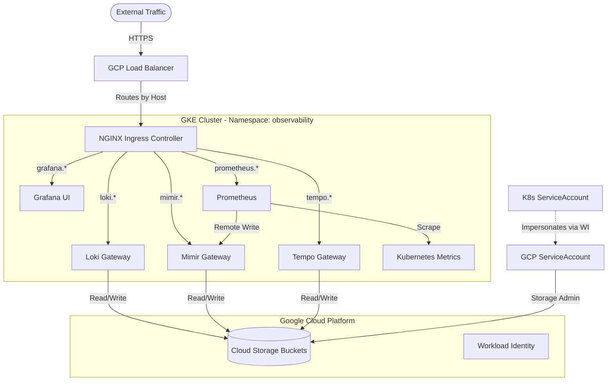

# LGTM Stack Terraform CLI Deployment

Infrastructure as Code deployment using Terraform for reproducible, version-controlled observability stack deployments.

Recommended for teams using infrastructure as code workflows, multi-environment deployments, or requiring reproducible configurations. This method provides full control over Terraform execution from your local machine or CI/CD pipeline.

**Official Documentation**: [Grafana Loki](https://grafana.com/docs/loki/latest/) | [Grafana Mimir](https://grafana.com/docs/mimir/latest/) | [Grafana Tempo](https://grafana.com/docs/tempo/latest/) | [Grafana](https://grafana.com/docs/grafana/latest/)

> **Already have LGTM Stack installed?** If you want to manage an existing observability stack deployment with Terraform, see [Adopting Existing Installation](adopting-lgtm-stack.md).

## Architecture

The stack provides comprehensive observability through integrated logging, metrics, and tracing with durable object storage.

### Components

| Component | Purpose | Storage Backend |
|-----------|---------|----------------|
| **Loki** | Distributed log aggregation | GCS (chunks, ruler) |
| **Mimir** | Long-term Prometheus metrics storage | GCS (blocks, ruler) |
| **Tempo** | Distributed tracing backend | GCS (traces) |
| **Prometheus** | Metrics collection and scraping | Remote write to Mimir |
| **Grafana** | Visualization and dashboarding | - |

### Infrastructure Flow



### Modular Components

The stack includes optional infrastructure components:

- **Cert-Manager**: TLS certificate automation (optional, can be shared)
- **NGINX Ingress**: External traffic management (optional, can be shared)

Set `install_cert_manager` and `install_nginx_ingress` to `false` in `terraform.tfvars` if these components are managed by other stacks.

## Prerequisites

Required tools and versions:

| Tool | Version | Verification Command |
|------|---------|---------------------|
| Terraform | ≥ 1.5.0 | `terraform version` |
| kubectl | ≥ 1.24 | `kubectl version --client` |
| Kubernetes cluster | ≥ 1.24 | `kubectl version` |

**Cloud Provider Requirements:**
- GKE: gcloud CLI authenticated (`gcloud auth login`)
- EKS: AWS CLI authenticated (`aws configure`)
- AKS: Azure CLI authenticated (`az login`)
- Generic: kubectl configured with cluster access

**Infrastructure Requirements:**
- Storage support: Cloud storage (GCS/S3/Azure Blob) or PersistentVolumes for generic Kubernetes
- Ingress controller: NGINX Ingress Controller (can be installed automatically)
- TLS certificates: cert-manager (can be installed automatically)
- Cluster access: `kubectl cluster-info` returns valid information

---

## Important: Multi-Cluster Environments

For deployments with multiple clusters, explicitly configure the target cluster in `terraform.tfvars` rather than relying on kubectl context.

**For GKE clusters:**
```bash
# Get cluster endpoint and CA certificate
gcloud container clusters describe CLUSTER_NAME \
  --region REGION \
  --project PROJECT_ID \
  --format='value(endpoint)' > endpoint.txt

gcloud container clusters describe CLUSTER_NAME \
  --region REGION \
  --project PROJECT_ID \
  --format='value(masterAuth.clusterCaCertificate)' > ca_cert.txt
```

Then configure in `terraform.tfvars`:
```hcl
gke_endpoint       = "34.123.45.67"      # From endpoint.txt
gke_ca_certificate = "LS0tLS1CRUdJ..."  # From ca_cert.txt
project_id         = "your-project-id"
```

---

## Terraform State Management

**Remote state backends are recommended** for team collaboration and state persistence, though local state is supported for development environments.

**Supported Backend Configurations:**

| Provider | Backend | State Path |
|----------|---------|-----------|
| GKE | Google Cloud Storage (GCS) | `gs://<bucket>/terraform/lgtm-stack/terraform.tfstate` |
| EKS | AWS S3 + DynamoDB locking | `s3://<bucket>/terraform/lgtm-stack/terraform.tfstate` |
| AKS | Azure Blob Storage | `azurerm://<container>/terraform/lgtm-stack/terraform.tfstate` |
| Generic | Local or custom remote backend | `./terraform.tfstate` (local) |

The backend configuration is generated automatically by the `configure-backend.sh` script or manually created. **For production deployments, always use remote state.**

For detailed state management documentation, see [Terraform State Management Guide](terraform-state-management.md).

---

## Installation

### Step 1: Navigate to Terraform Directory

```bash
cd lgtm-stack/terraform
```

---

### Step 2: Configure Backend (Required for Remote State)

**Option A: Using the configuration script (recommended)**

For GKE:
```bash
export TF_STATE_BUCKET="your-gcs-bucket"
../../.github/scripts/configure-backend.sh gke lgtm-stack
```

For EKS:
```bash
export TF_STATE_BUCKET="your-s3-bucket"
export AWS_REGION="us-east-1"
export TF_STATE_LOCK_TABLE="terraform-state-lock"  # Optional
../../.github/scripts/configure-backend.sh eks lgtm-stack
```

For AKS:
```bash
export AZURE_STORAGE_ACCOUNT="yourstorageaccount"
export AZURE_STORAGE_CONTAINER="terraform-state"
../../.github/scripts/configure-backend.sh aks lgtm-stack
```

For generic Kubernetes (local state):
```bash
../../.github/scripts/configure-backend.sh generic lgtm-stack
```

This creates `backend-config.tf` with the appropriate backend configuration.

**Option B: Manual backend configuration**

Create `backend-config.tf`:

For GKE (GCS backend):
```hcl
terraform {
  backend "gcs" {
    bucket = "your-gcs-bucket"
    prefix = "terraform/lgtm-stack"
  }
}
```

For EKS (S3 backend):
```hcl
terraform {
  backend "s3" {
    bucket         = "your-s3-bucket"
    key            = "terraform/lgtm-stack/terraform.tfstate"
    region         = "us-east-1"
    dynamodb_table = "terraform-state-lock"  # Optional, for state locking
  }
}
```

For AKS (Azure Blob backend):
```hcl
terraform {
  backend "azurerm" {
    storage_account_name = "yourstorageaccount"
    container_name       = "terraform-state"
    key                  = "terraform/lgtm-stack/terraform.tfstate"
  }
}
```

---

### Step 3: Create Configuration File

Copy the template and customize:

```bash
cp terraform.tfvars.template terraform.tfvars
```

**Variable Configuration Guide**

| Variable | Purpose | Configuration |
|----------|---------|---------------|
| `cloud_provider` | Target platform | `gke`, `eks`, `aks`, or `generic` |
| `project_id` | GCP Project ID (GKE only) | Required for GKE |
| `monitoring_domain` | Base domain for services | e.g., `monitoring.example.com` |
| `grafana_admin_password` | Grafana admin password | Secure password |
| `install_cert_manager` | Install cert-manager | `true` or `false` (if already installed) |
| `install_nginx_ingress` | Install NGINX Ingress | `true` or `false` (if already installed) |

Edit `terraform.tfvars`:

**Minimal configuration (GKE):**
```hcl
# Cloud Provider
cloud_provider = "gke"

# GCP Configuration
project_id       = "your-gcp-project-id"
region           = "us-central1"
cluster_name     = "your-cluster-name"
cluster_location = "us-central1"

# Domain and Environment
monitoring_domain      = "monitoring.example.com"
letsencrypt_email      = "admin@example.com"
environment            = "production"
grafana_admin_password = "change-this-secure-password"

# Optional: Disable if components already installed
install_cert_manager  = false
install_nginx_ingress = false
```

**Minimal configuration (EKS):**
```hcl
# Cloud Provider
cloud_provider = "eks"

# AWS Configuration
aws_region           = "us-east-1"
cluster_name         = "your-eks-cluster"
eks_oidc_provider_arn = "arn:aws:iam::123456789012:oidc-provider/oidc.eks..."

# Domain and Environment
monitoring_domain      = "monitoring.example.com"
letsencrypt_email      = "admin@example.com"
environment            = "production"
grafana_admin_password = "change-this-secure-password"

# Optional: Disable if components already installed
install_cert_manager  = false
install_nginx_ingress = false
```

**Minimal configuration (Generic Kubernetes):**
```hcl
# Cloud Provider
cloud_provider = "generic"

# Domain and Environment
monitoring_domain      = "monitoring.example.com"
letsencrypt_email      = "admin@example.com"
environment            = "production"
grafana_admin_password = "change-this-secure-password"

# Optional: Disable if components already installed
install_cert_manager  = false
install_nginx_ingress = false
```

**Configuration Variables:**

| Variable | Description | Default | Required |
|----------|-------------|---------|----------|
| `cloud_provider` | Target platform (gke/eks/aks/generic) | `gke` | Yes |
| `project_id` | GCP project ID | - | GKE only |
| `region` | GCP region | `us-central1` | GKE only |
| `aws_region` | AWS region | - | EKS only |
| `eks_oidc_provider_arn` | EKS OIDC provider ARN | - | EKS only |
| `cluster_name` | Kubernetes cluster name | - | Yes |
| `monitoring_domain` | Base domain for services | - | Yes |
| `letsencrypt_email` | Let's Encrypt email | - | Yes |
| `grafana_admin_password` | Grafana admin password | - | Yes |
| `namespace` | Kubernetes namespace | `lgtm` | No |
| `install_cert_manager` | Install cert-manager | `false` | No |
| `install_nginx_ingress` | Install NGINX Ingress | `false` | No |
| `loki_version` | Loki Helm chart version | `6.20.0` | No |
| `mimir_version` | Mimir Helm chart version | `5.5.0` | No |
| `tempo_version` | Tempo Helm chart version | `1.57.0` | No |
| `grafana_version` | Grafana Helm chart version | `10.3.0` | No |
| `prometheus_version` | Prometheus Helm chart version | `25.27.0` | No |

---

### Step 4: Verify Configuration

Before deploying, verify your configuration:

```bash
# Review your terraform.tfvars
cat terraform.tfvars | grep -E "cloud_provider|project_id|monitoring_domain|grafana_admin_password"
```

---

### Step 5: Initialize Terraform

```bash
terraform init
```

Expected output:
```
Initializing the backend...
Successfully configured the backend "gcs"!

Initializing provider plugins...
- Installing hashicorp/helm v2.12.x...
- Installing hashicorp/kubernetes v2.x...
- Installing hashicorp/google v5.x...

Terraform has been successfully initialized!
```

---

### Step 6: Plan Deployment

Review changes before applying:

```bash
terraform plan
```

**Review the plan output:**
- Helm releases for Loki, Mimir, Tempo, Grafana, Prometheus
- Cloud storage buckets (GCS/S3/Azure Blob) or PersistentVolumes
- Service accounts and IAM bindings (for cloud providers)
- Ingress resources for external access

Example output:
```
Terraform will perform the following actions:

  # helm_release.loki will be created
  + resource "helm_release" "loki" {
      + chart     = "loki"
      + namespace = "lgtm"
      + version   = "6.20.0"
      ...
    }

Plan: 15 to add, 0 to change, 0 to destroy.
```

---

### Step 7: Apply Configuration

Deploy the LGTM Stack:

```bash
terraform apply
```

Review the plan and type `yes` when prompted.

Installation typically completes in 5-10 minutes (includes storage provisioning, IAM setup, and Helm chart deployments).

**To skip confirmation prompt:**
```bash
terraform apply -auto-approve
```

---

### Step 8: Verify Deployment

Check all LGTM Stack pods:

```bash
kubectl get pods -n lgtm
```

All pods should be in Running status. Wait for all components to be ready:

```bash
kubectl wait --for=condition=ready pod \
  -l app.kubernetes.io/part-of=lgtm-stack \
  -n lgtm \
  --timeout=600s
```

## Verification

### Check Pod Status

```bash
kubectl get pods -n observability
```

All pods should be in `Running` state with `READY` showing expected replicas.


### Service Endpoints

After deployment, the following endpoints are available:

| Service | Endpoint | Purpose | Protocol |
|---------|----------|---------|----------|
| **Grafana** | `https://grafana.<monitoring_domain>` | Visualization dashboard | HTTPS |
| **Loki** | `https://loki.<monitoring_domain>/loki/api/v1/push` | Log ingestion | HTTP POST |
| **Mimir** | `https://mimir.<monitoring_domain>/prometheus/api/v1/push` | Metrics ingestion (Remote Write) | HTTP POST |
| **Tempo** (HTTP) | `https://tempo-push.<monitoring_domain>/v1/traces` | Trace ingestion (OTLP HTTP) | HTTP POST |
| **Tempo** (gRPC) | `tempo-grpc.<monitoring_domain>:443` | Trace ingestion (OTLP gRPC) | gRPC |
| **Prometheus** | `https://prometheus.<monitoring_domain>` | Metrics query interface | HTTPS |

### Test Connectivity

#### Verify Mimir Query API

```bash
curl -G "https://mimir.<monitoring_domain>/prometheus/api/v1/query" \
  --data-urlencode 'query=up'
```

Expected response: JSON with query results.

#### Verify Loki Ingestion

```bash
TIMESTAMP=$(date +%s)000000000
curl -H "Content-Type: application/json" \
  -XPOST "https://loki.<monitoring_domain>/loki/api/v1/push" \
  --data-raw "{\"streams\":[{\"stream\":{\"job\":\"test\"},\"values\":[[\"$TIMESTAMP\",\"test log entry\"]]}]}"
```

Expected response: HTTP 204 No Content.

### Access Grafana

1. Navigate to `https://grafana.<monitoring_domain>`
2. Login with:
   - **Username**: `admin`
   - **Password**: Value from `grafana_admin_password`


### Verify Datasources

In Grafana, navigate to **Connections** > **Data Sources** and verify:

- **Loki** - Connected
- **Mimir** - Connected  
- **Tempo** - Connected

## Operations

### Upgrade Components

Update chart versions in `terraform.tfvars`:

```hcl
loki_version = "6.20.0"  # Updated version
```

Apply changes:

```bash
terraform apply
```

**Important**: Test major version upgrades in a non-production environment first, especially for Loki schema changes.

### View Component Logs

```bash
# Loki logs
kubectl logs -n observability -l app.kubernetes.io/name=loki --tail=100

# Mimir logs
kubectl logs -n observability -l app.kubernetes.io/name=mimir --tail=100

# Grafana logs
kubectl logs -n observability -l app.kubernetes.io/name=grafana --tail=100
```

### Scale Components

Edit Helm values files in `values/` directory, then apply:

```bash
terraform apply
```

### Uninstall

```bash
terraform destroy
```

**Warning**: GCS buckets have `force_destroy = false` by default. Empty buckets manually if you want to delete data:

```bash
gcloud storage rm -r gs://PROJECT_ID-loki-chunks/**
gcloud storage rm -r gs://PROJECT_ID-mimir-blocks/**
gcloud storage rm -r gs://PROJECT_ID-tempo-traces/**
```

## Troubleshooting

### State Management Issues

| Issue | Cause | Solution |
|-------|-------|----------|
| **Backend configuration changed** | Backend config modified/regenerated | Run `terraform init -reconfigure` |
| **State lock acquisition error** | Another process running Terraform | Wait or `terraform force-unlock LOCK_ID` |
| **Bucket does not exist** | State bucket not created | Verify: `gcloud storage ls gs://your-bucket` |
| **Permission denied on bucket** | Insufficient IAM permissions | Grant `roles/storage.admin` to service account |
| **State file not found** | First deployment or deleted state | Normal for first run; import if state was lost |

### Terraform State Lock

```bash
# Check for running Terraform processes
ps aux | grep terraform

# Force unlock (only if no other process is running)
terraform force-unlock <LOCK_ID>
```

### Authentication Errors

```bash
# Re-authenticate with GCP
gcloud auth application-default login

# Verify credentials
gcloud auth application-default print-access-token
```

### Pods Stuck in Pending

```bash
# Check pod events
kubectl describe pod <pod-name> -n observability

# Common causes:
# - Insufficient CPU/memory
# - Unbound PersistentVolumeClaims
# - Node selector constraints

# Check node resources
kubectl top nodes
```

### GCS Permission Errors

```bash
# Verify Workload Identity binding
kubectl get sa observability-sa -n observability -o yaml | grep iam.gke.io

# Check GCP IAM policy
gcloud iam service-accounts get-iam-policy \
  gke-observability-sa@PROJECT_ID.iam.gserviceaccount.com
```

For detailed troubleshooting, see [Troubleshooting Guide](troubleshooting-lgtm-stack.md).

---

## Related Documentation

- [Manual Docker Compose Deployment](manual-lgtm-deployment.md) - Local development deployment
- [GitHub Actions Deployment](lgtm-stack-github-actions.md) - Automated CI/CD workflow
- [Terraform State Management](terraform-state-management.md) - Remote state configuration
- [Troubleshooting Guide](troubleshooting-lgtm-stack.md) - Common issues and resolutions
- [Adopting Existing Installation](adopting-lgtm-stack.md) - Migration guide
- [Alloy Configuration Guide](alloy-config.md) - Telemetry collector configuration
- [Testing & Verification](testing-monitoring-stack-deployment.md) - Validation procedures

---

**Official Documentation**: [Grafana Loki](https://grafana.com/docs/loki/latest/) | [Grafana Mimir](https://grafana.com/docs/mimir/latest/) | [Grafana Tempo](https://grafana.com/docs/tempo/latest/) | [Grafana](https://grafana.com/docs/grafana/latest/)